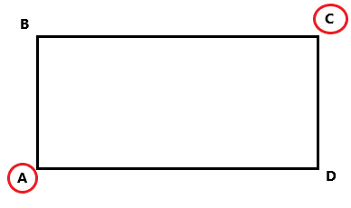

# Buildify-API

REST API for managing organizations, buildings, and activities.

### Setup

- Rename **example.env** to **.env**;
- Fill in the variables **DB_USER**, **DB_PASSWORD**, **DB_NAME**, **DB_HOST**, **DB_PORT**, **DATABASE_URL**, **DEV**, **API_KEY** with your own values;

### Start

`git clone https://github.com/fedorov0av/Buildify-API.git`

`cd Buildify-API/`

`docker compose up -d`

### Endpoints

* **/api/v1/org-info-by-id** - retrieves information about an organization by its ID
  
* **/api/v1/org-info-by-name** - searches for an organization by its name

* **/api/v1/org-info-by-address** - lists all organizations located in a specific building

* **/api/v1/org-by-activity** - lists all organizations related to a specified activity type

* **/api/v1/orgs-by-activities** - search for organizations by activity type with nested results

* **/api/v1/orgs-by-geo** - lists organizations located within a specified rectangular area relative to a given point on the map. The rectangle is defined by two points, A and C (see Fig. 1), while points B and D are assigned automatically.

_Fig. 1_

### Documentation

* **/api/swagger** - Swagger UI

* **/api/redoc** - Redoc

